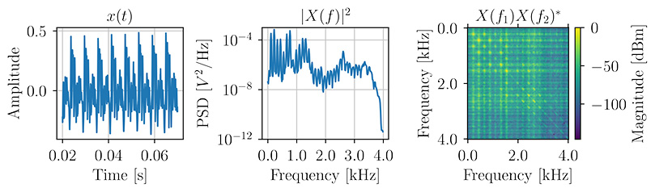

# SVD-direct
## Introduction
This code accompanies the paper *Wideband Relative Transfer Function (RTF) Estimation Exploiting Frequency Correlations*,
published in the IEEE Transactions on Audio, Speech and Language Processing (TASLP) in 2025. 

IEEE Xplore: https://ieeexplore.ieee.org/document/10852350
ArXiv: https://arxiv.org/abs/2407.14152



The paper proposes a new method for estimating the relative acoustic transfer function (RTF) of a room.
The idea is to exploit the frequency correlations in the signals received by the microphones to improve the estimation of the RTF.
In multi-microphone beamforming, the RTF is used to not only estimate the direction-of-arrival of a source, but also
the effect of the early reflections on the signal. This is important for dereverberation and noise reduction.

## Installation and first run
### Prerequisites
1. Python 3.9 or newer installed.
2. The code was tested on MacOS 13.4.1, but should work on Linux as well.

### Preparation
1. Open a terminal and navigate to the root of the project.
2. Clone this repository with `git clone git@github.com:Screeen/SVD-direct.git` or download the zip file and extract it. 
3. Execute `chmod +x scripts_bash/run_talsp2025` to make the script executable.
4. Run `python3 -m venv .env` to create a virtual environment.
5. Activate the virtual environment with `source .env/bin/activate`
6. Install the required packages with
```
pip install --upgrade pip
pip install -r requirements.txt
pip install https://github.com/schmiph2/pysepm/archive/master.zip  # for evaluation
```
9. Run the unit tests with
```
cd src
python3 acoustic_estimator_test.py
```
If everything went well, you should see something like this:
```
WARNING! DEFAULT RANDOM SEED, experiments will give same result over and over.
noise_cov_description = 'identity'
noise_cov_description = 'wgn + identity'
noise_cov_description = 'spd'
noise_cov_description = 'correlated'
estimate_rtf_covariance_subtraction...
```

### Running the experiments
8. We are now ready to run the experiments. First lets do a quick round to make sure everything works:
```
cd .. 
./scripts_bash/run_talsp2025 1 equal
```
Runs the **first experiment** ('equal variances') with *Montecarlo constant* 1 (which means very few Montecarlo iterations will be run).
The results will be stored in `../out/talsp2025/something_something`.

If you get
```
ImportError: cannot import name 'kaiser' from 'scipy.signal' (.../.venv/lib/python3.12/site-packages/scipy/signal/__init__.py). Did you mean: 'kaiserord'?
```
Open the file
```
nano .../SVD-direct/env/lib/python3.12/site-packages/pysepm/util.py
```
and replace 
```
from scipy.signal import firls,kaiser,upfirdn
```
with
```
from scipy.signal import firls,upfirdn
from scipy.signal.windows import kaiser
```

If you are ready to wait, you can run the first synthetic data experiment (Section VI.A of the paper) with 
```
./scripts_bash/run_talsp2025 1e9 equal
```
This will take around an hour to complete.

9. To run the second synthetic data experiment (Section VI.B of the paper), type
```
./scripts_bash/run_talsp2025 1e9 unequal
```

10. To run the real data experiments (Sections VI.D and VI.E), run
```
python -m scripts.run_experiments --exp_name speech_all
```
By default, they will run using the demo files. To reproduce the experiments in the paper, you need to download the RIRs from https://www.iks.rwth-aachen.de/en/research/tools-downloads/databases/multi-channel-impulse-response-database/ and convert them to WAV format using `scripts/2025-02-convert-Hadad-to-wav.py`.
You also need to download the ESC-50 dataset for the noises and buy the “Speech Intelligibility CD” from Neil Thompson Shade for the target speech.

11. To change the simulation parameters, check the YAML files in `configs/`.

12. You can also export plots with Tex fonts `python run_experiments\ plots.py -t ../out/talsp2025`
13. Unfortunately, because the real data used in the paper is proprietary, we cannot share it here. But you can still run the code on your own data.
In general, use this script to run the experiments:
```
python -m scripts.run_experiments --help
```
Which will give you this output:
```
usage: run_experiments.py [-h] [--exp_name EXP_NAME] [--repeated_experiments_constant REPEATED_EXPERIMENTS_CONSTANT] [--use_multiple_processes USE_MULTIPLE_PROCESSES]
                                                    [--target_noise_equal_variances | --no-target_noise_equal_variances]

Run RTF estimation and beamforming experiments.

options:
  -h, --help            show this help message and exit
  --exp_name EXP_NAME   Experiment name, options: ['speech_num_mics', 'speech_time_seconds', 'speech_snr', 'speech_noise_position', 'target_correlation', 'noise_correlation', 'time_frames', 'snr']
  --repeated_experiments_constant REPEATED_EXPERIMENTS_CONSTANT
                        Number of repeated experiments, e.g. 1e6, 1e8, 1e11
  --use_multiple_processes USE_MULTIPLE_PROCESSES
                        Use multiple processes
  --target_noise_equal_variances, --no-target_noise_equal_variances
```

So, for example, to run the experiments on speech you could use this command:
```
python -m scripts.run_experiments --exp_name speech_snr --repeated_experiments_constant 1 --use_multiple_processes True
```

You can also use
```
python -m scripts.run_experiments --exp_name all
```
to run all experiments.

# How to cite
G. Bologni, R. C. Hendriks and R. Heusdens, "Wideband Relative Transfer Function (RTF) Estimation Exploiting Frequency Correlations," in IEEE Transactions on Audio, Speech and Language Processing, vol. 33, pp. 731-747, 2025, doi: 10.1109/TASLPRO.2025.3533371. 

> [!NOTE]
> Any feedback is welcome: Text me here or at G.Bologni@tudelft.nl.
> And have fun with the code!
